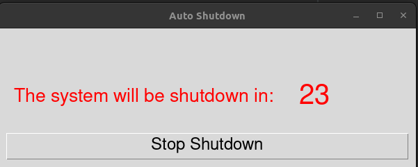

# AYSA - **A**re **Y**ou **S**till **A**live
This application provides a simple UI to automatically shut down your PC if no input is provided, e.g. if you
have fallen asleep in front of your streaming PC.


## Usage
```bash
aysa [time_to_shutdown_in_sec|default=30]
```

## Install
You can either download the latest [release](https://github.com/mauamy/aysa/releases/latest) or 
build it from source.

## Build from Source
### Requirements
- virtualenv

#### Install:
```bash
sudo apt install virtualenv
```

```bash
git clone <>
cd <>

# create and activate your virtual python environment
virtualenv venv
source venv/bin/activate

# build
make build

# install 
make install
```

## Setup Crontab
You can run AYSA via a crontab on several hours you might have fallen asleep:

For example, run it at 11 and 12pm on weekdays and on 1am and 2am on weekends:
```bash
# m h  dom mon dow   command
0 1-2 * * 6,0 DISPLAY=:0 /usr/local/bin/aysa
0 11,12 * * 1-5 DISPLAY=:0 /usr/local/bin/aysa
```
Adjust this to your personal needs.